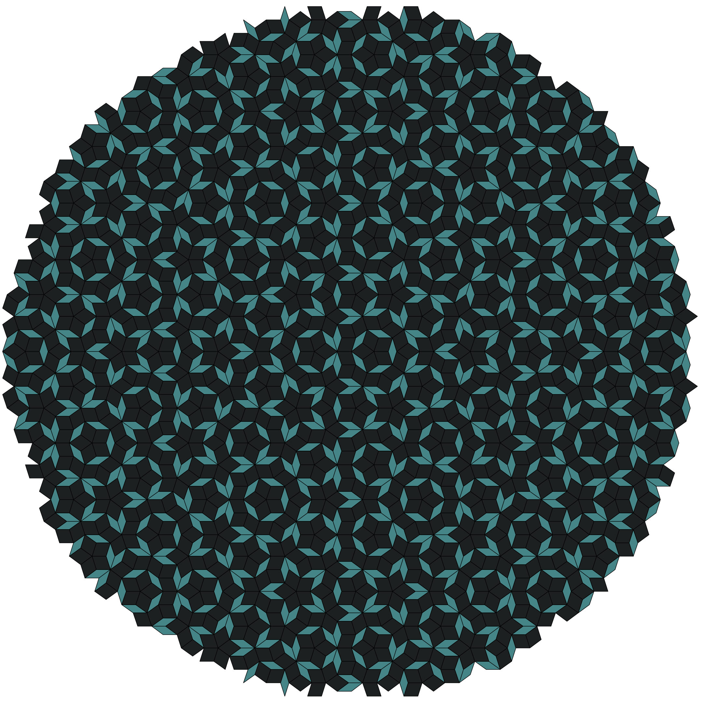

<image width="100px" src="icon.svg" align="left"></image>
My Penrose Config
=================

penrose:  

This is my personal config for the penrose tiling WM library.
It relies heavily on a number of custom scripts and external programs, in
addition to being heavily customised for my day to day workflow. You probably
don't want to use everything that is here but you may find some things of
interest that you want for your own config.

### Supporting files
I have included some of the `scripts` and `.config` directories that I use in my
personal set up which is what you will see in the
[YouTube](https://www.youtube.com/channel/UC04N-5DxEWH4ioK0bvZmF_Q) videos
showcasing penrose.
My patched forks of the suckless tools can be found [here](https://github.com/sminez/suckless).

### Wallpaper
The wallpaper that I use is, fittingly, a penrose tiling. It was generated using
a wonderful [online tool](https://misc.0o0o.org/penrose/) that I found which you
can use to generate your own wallpapers should you wish. You'll need to use a
tool such as `imagemagick` to convert the SVG generated by the site into
something like a PNG so that you can use it as a wallpaper.

